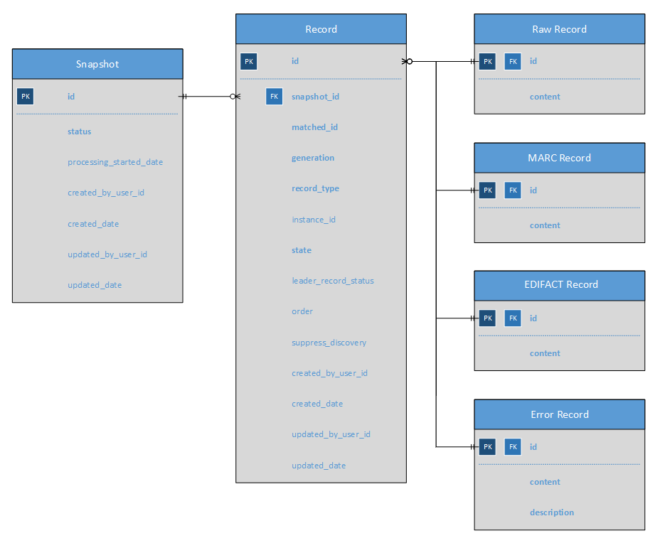

# mod-source-record-storage

Copyright (C) 2018-2019 The Open Library Foundation

This software is distributed under the terms of the Apache License,
Version 2.0. See the file "[LICENSE](LICENSE)" for more information.

<!-- ../../okapi/doc/md2toc -l 2 -h 4 README.md -->
* [Introduction](#introduction)
* [Compiling](#compiling)
* [Docker](#docker)
* [Installing the module](#installing-the-module)
* [Deploying the module](#deploying-the-module)
* [Database schemas](#database-schemas)
* [How to fill module with data for testing purposes](https://wiki.folio.org/x/G6bc)

## Introduction

FOLIO compatible source record storage module.

Provides PostgreSQL based storage to complement the data import module. Written in Java, using the raml-module-builder and uses Maven as its build system.

## Compiling

> [Docker](https://www.docker.com/) is now required to build mod-source-record-storage. [docker-maven-plugin](https://dmp.fabric8.io/) is used to create a Postgres Container
for running [Liquibase](https://www.liquibase.org/) scripts and generating [jOOQ](https://www.jooq.org/) schema DAOs for type safe SQL query building.

```
   mvn install
```

See that it says "BUILD SUCCESS" near the end.

## Docker

Build the docker container with:

```
   docker build -t mod-source-record-storage .
```

Test that it runs with:

```
   docker run -t -i -p 8081:8081 mod-source-record-storage
```

## Installing the module

Follow the guide of
[Deploying Modules](https://github.com/folio-org/okapi/blob/master/doc/guide.md#example-1-deploying-and-using-a-simple-module)
sections of the Okapi Guide and Reference, which describe the process in detail.

First of all you need a running Okapi instance.
(Note that [specifying](../README.md#setting-things-up) an explicit 'okapiurl' might be needed.)

```
   cd .../okapi
   java -jar okapi-core/target/okapi-core-fat.jar dev
```

We need to declare the module to Okapi:

```
curl -w '\n' -X POST -D -   \
   -H "Content-type: application/json"   \
   -d @target/ModuleDescriptor.json \
   http://localhost:9130/_/proxy/modules
```

That ModuleDescriptor tells Okapi what the module is called, what services it
provides, and how to deploy it.

## Deploying the module

Next we need to deploy the module. There is a deployment descriptor in
`target/DeploymentDescriptor.json`. It tells Okapi to start the module on 'localhost'.

Deploy it via Okapi discovery:

```
curl -w '\n' -D - -s \
  -X POST \
  -H "Content-type: application/json" \
  -d @target/DeploymentDescriptor.json  \
  http://localhost:9130/_/discovery/modules
```

Then we need to enable the module for the tenant:

```
curl -w '\n' -X POST -D -   \
    -H "Content-type: application/json"   \
    -d @target/TenantModuleDescriptor.json \
    http://localhost:9130/_/proxy/tenants/<tenant_name>/modules
```


## Interaction with Kafka


There are several properties that should be set for modules that interact with Kafka: **KAFKA_HOST, KAFKA_PORT, OKAPI_URL, ENV**(unique env ID).
After setup, it is good to check logs in all related modules for errors. Data import consumers and producers work in separate verticles that are set up in RMB's InitAPI for each module. That would be the first place to check deploy/install logs.

**Environment variables** that can be adjusted for this module and default values:
* Relevant for the **Iris** release, module versions from 5.0.0:
  * "_srs.kafka.ParsedMarcChunkConsumer.instancesNumber_": 1
  * "_srs.kafka.DataImportConsumer.instancesNumber_": 1
  * "_srs.kafka.ParsedRecordChunksKafkaHandler.maxDistributionNum_": 100
  * "_srs.kafka.DataImportConsumer.loadLimit_": 5
  * "_srs.kafka.DataImportConsumerVerticle.maxDistributionNum_": 100
  * "_srs.kafka.ParsedMarcChunkConsumer.loadLimit_": 5
* Relevant for the **Juniper** release, module versions from 5.1.0:
  * "_srs.kafka.QuickMarcConsumer.instancesNumber_": 1
  * "_srs.kafka.QuickMarcKafkaHandler.maxDistributionNum_": 100
  * "_srs.kafka.cache.cleanup.interval.ms_": 3600000
  * "_srs.kafka.cache.expiration.time.hours_": 3
## Database schemas

The mod-source-record-storage module uses relational approach and Liquibase to define database schemas.

Database schemas are described in Liquibase scripts using XML syntax.
Every script file should contain only one "databaseChangeLog" that consists of at least one "changeset" describing the operations on tables. 
Scripts should be named using following format:
`yyyy-MM-dd--hh-mm-schema_change_description`.  \
`yyyy-MM-dd--hh-mm` - date of script creation;  \
`schema_change_description` - short description of the change.

Each "changeset" should be uniquely identified by the `"author"` and `"id"` attributes. It is advised to use the Github username as `"author"` attribute. 
The `"id"` attribute value should be defined in the same format as the script file name.  

If needed, database schema name can be obtained using Liquibase context property `${database.defaultSchemaName}`.

Liquibase scripts are stored in `/resources/liquibase/` directory.
Scripts files for module and tenant schemas are stored separately in `/resources/liquibase/module/scripts` and `/resources/liquibase/tenant/scripts` respectively.
\
To simplify the tracking of schemas changes, the tenant versioning is displayed in the directories structure:
```
/resources/liquibase
    /tenant/scripts
              /v-1.0.0
                  /2019-08-14--14-00-create-tenant-table.xml
              /v-2.0.0
                  /2019-09-03--11-00-change-id-column-type.xml
    /tenant/scripts
              /v-1.0.0
                  /2019-09-06--15-00-create-record-field-table.xml
```

### Database redesign

The database has recently been redesigned to use standard relational table design with less usage of JSONB columns and more use of foreign key constraints and default B-tree indexes optimized for single value columns. The rational was to improve performance of data retrieval and data import. A significant change was the addition of `leader_record_status` column on the `records` table that is populated via a trigger on insert and update on the `marc_records` table. This provides ability to query on status of MARC record quickly and also condition appropriate leader record status that indicate the record has been deleted.



## [jOOQ](https://www.jooq.org/)

During the redesign we opted to use jOOQ for type safe fluent SQL building. The jOOQ type safe tables and resources are generated during the `generate-source` Maven lifecycle using [vertx-jooq](https://github.com/jklingsporn/vertx-jooq) reactive Vert.x generator. The code is generated from the database metadata. For this to occur during build, `liquibase-maven-plugin` is used to consume the Liquibase changelog and provision a temporary database started using `embedded-postgresql-maven-plugin`.

> jOOQ affords plain SQL strings, but it is not recommended. Use of type safe Java abstraction including variable binding eliminates SQL injection vulnerabilities.

## REST Client for mod-source-record-storage

For using module's endpoints it provides generated by RMB client. This client is packaged into the lightweight jar.

### Maven dependency 

```xml
    <dependency>
      <groupId>org.folio</groupId>
      <artifactId>mod-source-record-storage-client</artifactId>
      <version>x.y.z</version>
      <type>jar</type>
    </dependency>
```
Where x.y.z - version of mod-source-record-storage.

### Usage

SourceStorageClient is generated by RMB and provides methods for all modules endpoints described in the RAML file
```java
    // create records client object with okapi url, tenant id and token
    SourceStorageRecordsClient client = new SourceStorageRecordsClient("localhost", "diku", "token");
```
Client methods work with generated by RMB data classes based on json schemas. 
mod-source-record-storage-client jar contains only generated by RMB DTOs and clients. 
```
    // create new record entity
    Record record = new Record();
    record.setRecordType(Record.RecordType.MARC_BIB);
    record.setRawRecord(new RawRecord().withContent("content"));
```
Example with sending request to the mod-source-record-storage for creating new Record
```
    // send request to mod-source-record-storage
    client.postSourceStorageRecords(null, record, response -> {
      // processing response
      if (response.statusCode() == 201) {
        System.out.println("Record is successfully created.");
      }
    });
```

## Load sample data for module testing
To load sample data after module initialization, you need to POST [testMarcRecordsCollection](https://github.com/folio-org/data-import-raml-storage/blob/master/schemas/mod-source-record-storage/testMarcRecordsCollection.json) DTO to `/source-storage/populate-test-marc-records`.

```
{
  "rawRecords": [
    ...
  ]
}
```
 
## Issue tracker

See project [MODSOURCE](https://issues.folio.org/browse/MODSOURCE)
at the [FOLIO issue tracker](https://dev.folio.org/guidelines/issue-tracker/).
